# Задание 1. Анализ и планирование (AS-IS) - монолитное приложение

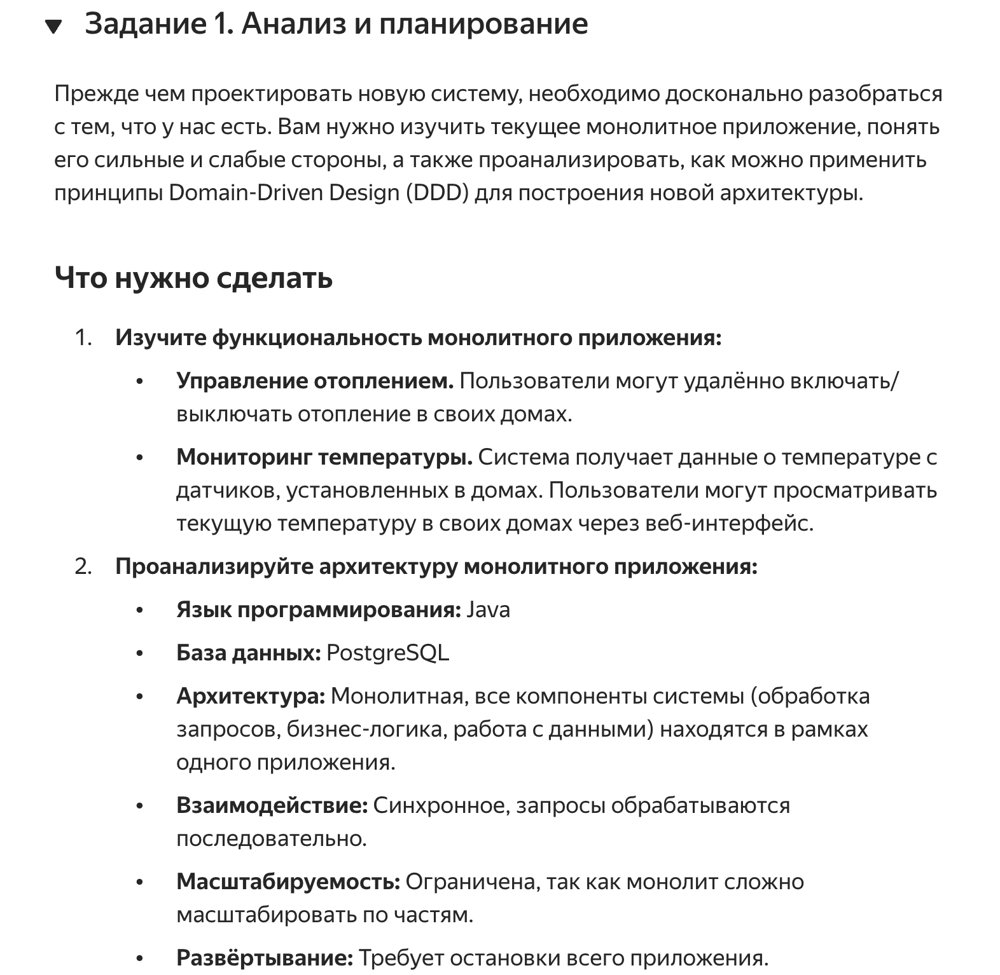

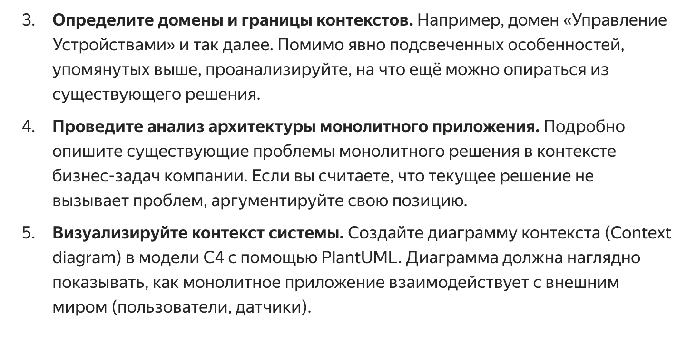

## Функционал монолитного приложения

- **Управление отоплением**: Пользователи могут удалённо включать и выключать отопление в своих домах.
- **Мониторинг температуры**: Система получает данные о температуре с датчиков, установленных в домах. Пользователи могут просматривать текущую температуру через веб-интерфейс.
- **Установка температуры**: Пользователи могут устанавливать температуру через веб-интерфейс.

## Анализ текущей реализации

## а) Анализ архитектуры монолитного приложения

1. **Язык программирования**: Java
2. **База данных**: PostgreSQL
3. **Архитектура**: Монолитная. Все компоненты — обработка запросов, бизнес-логика и работа с данными — находятся в одном приложении.
4. **Взаимодействие**: Синхронное; запросы обрабатываются последовательно.
5. **Масштабируемость**: Ограничена из-за трудности разделения на части.
6. **Развёртывание**: Требует полной остановки приложения для обновлений.
7. **Обслуживание пользователей**: У пользователя нет возможности подключить новые датчики самостоятельно, требуется участие технического специалиста.

## Общие проблемы и улучшения - от монолита к микросервисам

### б) Проблемы монолита:

- **Сложности с масштабируемостью:** Монолит трудно масштабировать частично, что ограничивает гибкость.
- **Трудности при обновлении:** Для внесения изменений требуется полная остановка, что может вызвать простой.
- **Увеличение сложности поддержки:** По мере роста кода и функционала усложняется поддержка.

### Возможные улучшения:

- Рассмотреть переход на **микросервисную архитектуру**, разделив приложение на отдельные сервисы (например, для управления устройствами и мониторинга).
- Использовать **асинхронные очереди** для более эффективного взаимодействия и масштабирования.
- Выделить **отдельные модули для различных доменов**, чтобы уменьшить зависимости и упростить процесс разработки и развёртывания.

## Определение доменов и границ контекстов

### Основные домены включают:

- **Управление устройствами:** Включает функции включения и выключения отопления, а также доступ к данным с датчиков.
- **Мониторинг и отображение:** Обеспечивает просмотр текущих температурных данных через пользовательский интерфейс.

### Возможные дополнительные домены:

- **Управление пользователями:** Контроль доступа к данным и управлению устройствами.
- **Настройка уведомлений:** Опции для оповещения пользователей о критических изменениях температуры.

## Диаграмма контекста

Диаграмма расположена здесь (также скрин ниже):
```bash
.\C4\smart-home_context.puml
```
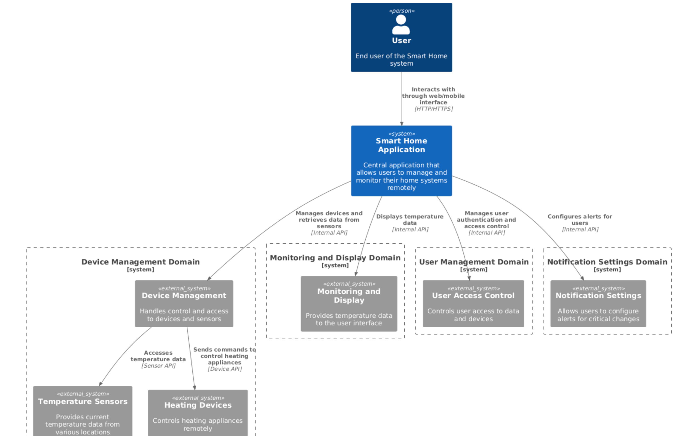

# Задание 2. Проектирование целевой архитектуры

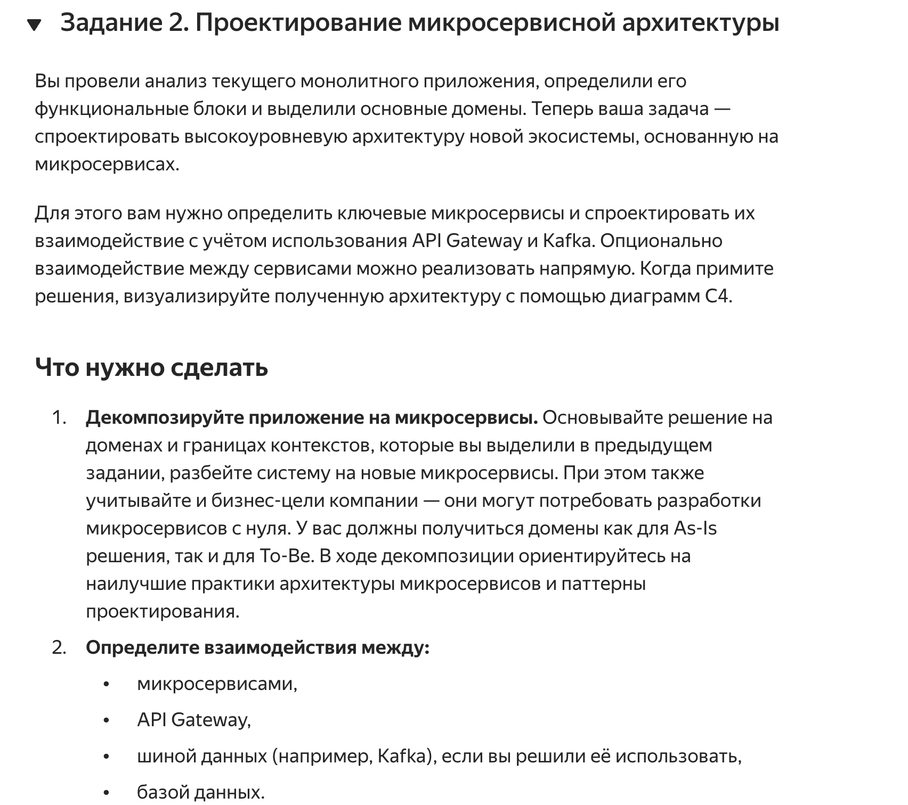

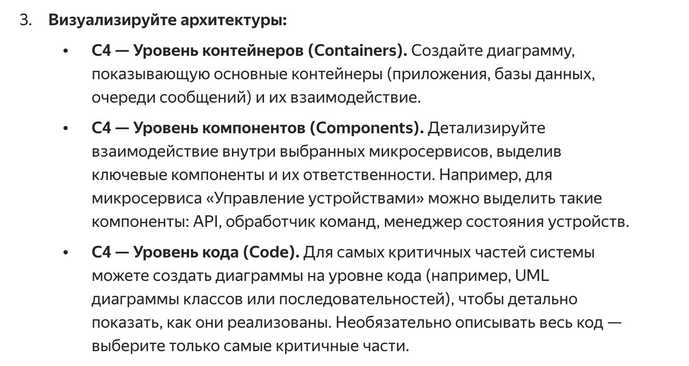

## C4 — Уровень контейнеров (Containers)

Переделал под требования задания:

## Обновленное описание архитектуры микросервисов

### 1. Device Management Service (Сервис управления устройствами)
- Управляет отопительными приборами и температурными датчиками.
- Позволяет включать/выключать устройства и получать их текущее состояние.
- Получает запросы на управление устройствами и данные от устройств через API Gateway.

### 2. Temperature Monitoring Service (Сервис мониторинга температуры)
- Считывает и хранит данные о температуре с датчиков, привязанных к устройствам.
- Получает запросы на данные о температуре через API Gateway и отправляет обновления через Message Broker для других сервисов.

### 3. User Management Service (Сервис управления пользователями)
- Управляет регистрацией, аутентификацией и авторизацией пользователей.
- Предоставляет данные о правах доступа и управляет доступом пользователей через API Gateway.

### 4. Notification Service (Сервис уведомлений)
- Настраивает и отправляет уведомления пользователям о критических изменениях, таких как высокая температура или сбой устройства.
- Получает данные о состоянии устройств и температуре через Message Broker для отправки уведомлений на основе событий.

### 5. API Gateway
- Центральный шлюз, принимающий все запросы от пользователей и устройств.
- Выполняет маршрутизацию запросов к соответствующим микросервисам, обеспечивает аутентификацию и авторизацию, улучшает безопасность и контроль доступа.

### 6. Message Broker (Kafka)
- Обеспечивает асинхронное взаимодействие между микросервисами.
- Передает сообщения о состоянии устройств и изменениях температуры, которые используются для отправки уведомлений и логирования.

### 7. Device (Сущность)
- Представляет собой физическое устройство, такое как датчик температуры или отопительный прибор.
- Работает через API Gateway для передачи своего состояния и данных в систему, а также для получения команд (например, включения/выключения).

---

### Основные взаимодействия

- Пользователь и **Device** взаимодействуют с системой через **API Gateway**.
- **API Gateway** маршрутизирует запросы от устройств к **Device Management Service** для управления состоянием устройств и к **Temperature Monitoring Service** для данных о температуре.
- **Device Management Service** и **Temperature Monitoring Service** передают данные о состоянии и температуре через **Message Broker (Kafka)** для **Notification Service**, который обрабатывает события и отправляет уведомления пользователям при необходимости.
- **User Management Service** обеспечивает аутентификацию и авторизацию пользователей через **API Gateway** и хранит данные о пользователях в базе данных.

Этот подход упрощает взаимодействие, централизует доступ и повышает безопасность системы.

Диаграмма контейнеров расположена здесь (рисунок ниже):
```bash
.\С4\smarthome_container.puml
```
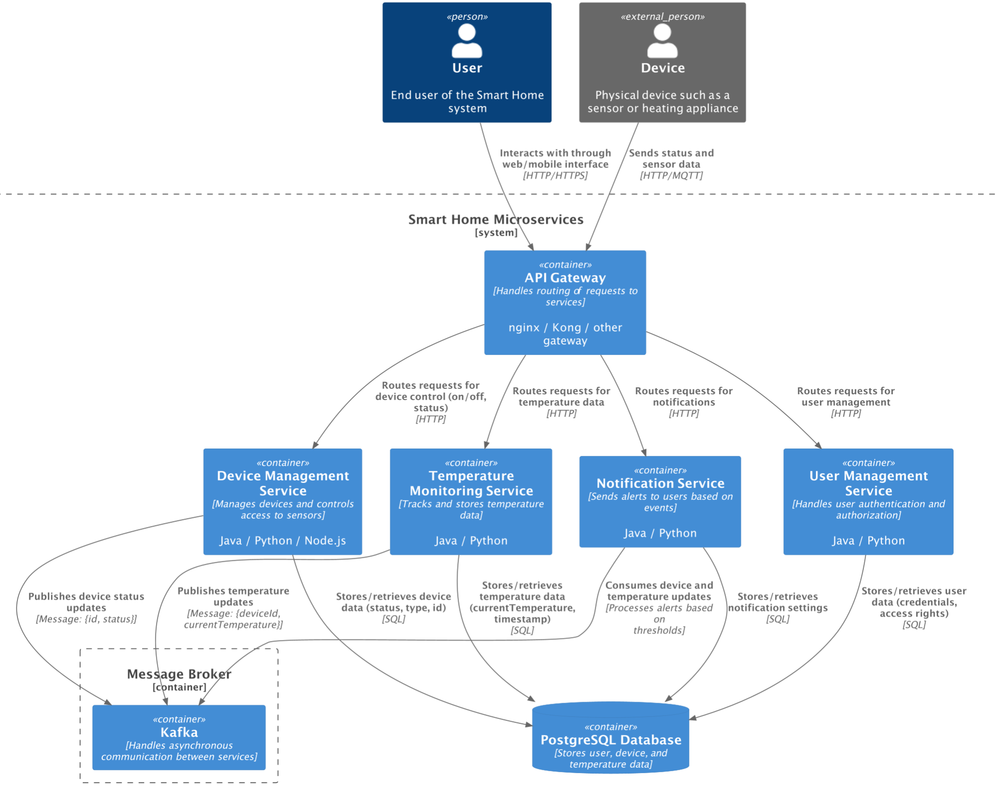

## C4 — Уровень компонентов (Components)

### Компоненты для приложения SmartHomeSystem

### Обзор Системы

### Внешние Сущности

**User** и **Device** представлены как внешние сущности, взаимодействующие с системой через API Gateway.

- **User** — конечный пользователь системы, отправляющий запросы на управление устройствами, просмотр температуры и настройку уведомлений через веб- или мобильный интерфейс.
- **Device** — физическое устройство, такое как датчик или отопительный прибор, которое отправляет данные о своем состоянии и получает команды через API Gateway.

### API Gateway

**API Gateway** маршрутизирует запросы от User и Device к соответствующим компонентам в микросервисах, таким как Device Management Service и Temperature Monitoring Service.

### Компоненты Микросервисов

Следующие микросервисы состоят из нескольких ключевых компонентов:

1. **Device Management Service**
2. **Temperature Monitoring Service**
3. **User Management Service**
4. **Notification Service**

Каждый микросервис включает:

- **Controller** — REST API контроллер, обрабатывающий внешние запросы.
- **Service** — бизнес-логика, управляющая основными операциями и взаимодействием с данными.
- **Repository** — компонент доступа к данным, который сохраняет и извлекает данные из базы.
- **Publisher/Subscriber** — компоненты для взаимодействия с Message Broker (Kafka).

**Message Broker** (Kafka) содержит топики для обмена данными между микросервисами, включая статусы устройств, данные о температуре и уведомления о критических событиях.

Ниже подробно:

### 1. Device Management Service
- **DeviceController** — REST API контроллер для обработки внешних запросов на управление устройствами (включение/выключение).
- **DeviceService** — бизнес-логика для управления устройствами; взаимодействует с репозиторием и брокером сообщений.
- **DeviceRepository** — слой доступа к данным, отвечает за хранение и получение данных об устройствах из базы данных.
- **DeviceStatusPublisher** — компонент, публикующий обновления о статусе устройств в Message Broker (Kafka).

### 2. Temperature Monitoring Service
- **TemperatureController** — REST API контроллер для получения данных о температуре.
- **TemperatureService** — бизнес-логика для мониторинга температуры, включает обработку данных и проверку порогов.
- **TemperatureRepository** — слой доступа к данным, сохраняет данные о температуре в базе данных.
- **TemperaturePublisher** — компонент, публикующий обновления температуры в Message Broker (Kafka).

### 3. User Management Service
- **UserController** — REST API контроллер для аутентификации и авторизации пользователей.
- **UserService** — бизнес-логика для управления пользователями, включая проверку доступа и авторизацию.
- **UserRepository** — слой доступа к данным, отвечает за хранение информации о пользователях в базе данных.

### 4. Notification Service
- **NotificationController** — REST API контроллер для настройки уведомлений.
- **NotificationService** — бизнес-логика для отправки уведомлений при критических изменениях, интеграция с почтой или push-уведомлениями.
- **NotificationRepository** — слой доступа к данным, хранит настройки уведомлений и историю.
- **NotificationSubscriber** — компонент, который подписывается на обновления от Message Broker (Kafka) и запускает уведомления при необходимости.

### 5. API Gateway
- **RoutingComponent** — маршрутизирует запросы пользователей к соответствующим микросервисам.
- **AuthenticationComponent** — проверяет права доступа пользователей, взаимодействует с User Management Service для аутентификации.

### 6. Message Broker (Kafka)
- **DeviceTopic** — топик для сообщений о статусе устройств.
- **TemperatureTopic** — топик для сообщений о температуре.
- **NotificationTopic** — топик для уведомлений о критических событиях.

Диаграмма компонентов расположена здесь (рисунок ниже):
```bash
.\С4\components\smarthome_comp.puml
```
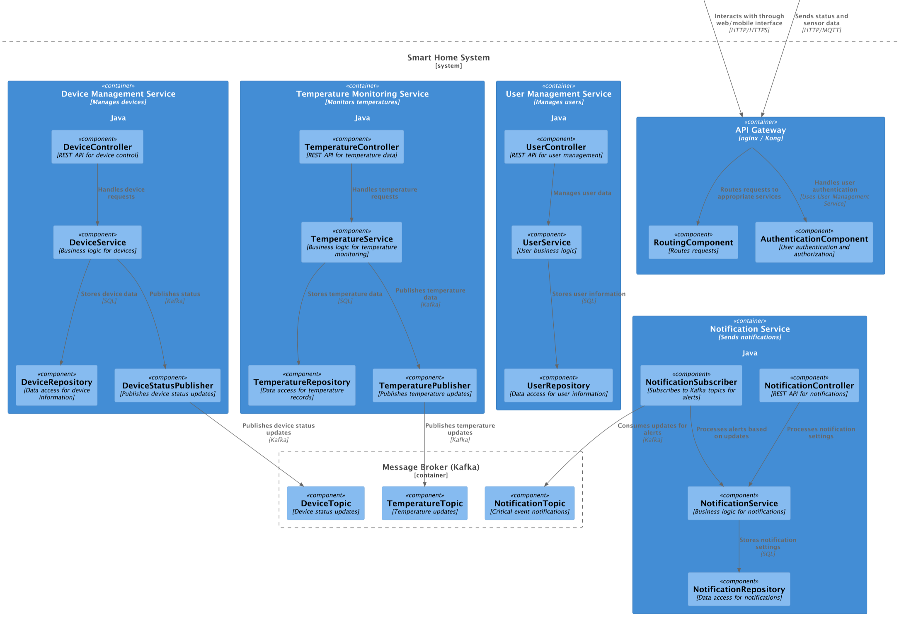

## C4 — Уровень кода (Code)

## Основные классы и их описание:

### 1. Домен управления устройствами (Device Management)

- **DeviceController**  
  Контроллер, который управляет внешними запросами на управление устройствами.

- **DeviceService**  
  Класс, реализующий бизнес-логику управления устройствами, такими как включение и выключение, а также получение текущего состояния.

- **DeviceRepository**  
  Класс для доступа к данным, отвечающий за хранение информации об устройствах в базе данных.

- **Device**  
  Класс, представляющий устройство.  
  **Поля**:
    - `id` - уникальный идентификатор устройства
    - `type` - тип устройства
    - `status` - текущее состояние устройства (включено/выключено)
    - `location` - местоположение устройства

### 2. Домен мониторинга температуры (Temperature Monitoring)

- **TemperatureController**  
  Контроллер для обработки запросов на получение данных о температуре.

- **TemperatureService**  
  Класс, реализующий бизнес-логику для мониторинга температуры.

- **TemperatureRepository**  
  Класс для доступа к данным, отвечает за хранение истории температур.

- **TemperatureSensor**  
  Класс, представляющий датчик температуры.  
  **Поля**:
    - `id` - уникальный идентификатор датчика
    - `deviceId` - идентификатор устройства, к которому прикреплен датчик
    - `currentTemperature` - текущее значение температуры
    - `lastUpdated` - время последнего обновления данных

### 3. Домен управления пользователями (User Management)

- **UserController**  
  Контроллер для обработки запросов пользователей на регистрацию, аутентификацию и авторизацию.

- **UserService**  
  Класс, управляющий бизнес-логикой пользователей, включая авторизацию и проверку доступа.

- **UserRepository**  
  Класс для доступа к данным пользователей, хранит данные пользователей в базе.

- **User**  
  Класс, представляющий пользователя.  
  **Поля**:
    - `id` - уникальный идентификатор пользователя
    - `name` - имя пользователя
    - `email` - электронная почта пользователя
    - `password` - пароль пользователя
    - `role` - роль пользователя в системе (например, администратор, пользователь)

### 4. Домен уведомлений (Notification)

- **NotificationController**  
  Контроллер для управления настройками уведомлений.

- **NotificationService**  
  Класс для бизнес-логики уведомлений, включая отправку уведомлений.

- **NotificationRepository**  
  Класс для доступа к данным, хранит настройки уведомлений и историю отправленных уведомлений.

- **Notification**  
  Класс, представляющий уведомление.  
  **Поля**:
    - `id` - уникальный идентификатор уведомления
    - `userId` - идентификатор пользователя, которому предназначено уведомление
    - `message` - сообщение уведомления
    - `type` - тип уведомления (например, ошибка, предупреждение, информация)
    - `timestamp` - временная метка отправки уведомления

Диаграмма классов/кода расположена здесь (рисунок ниже):
```bash
.\С4\code\smarthome_code.puml
```
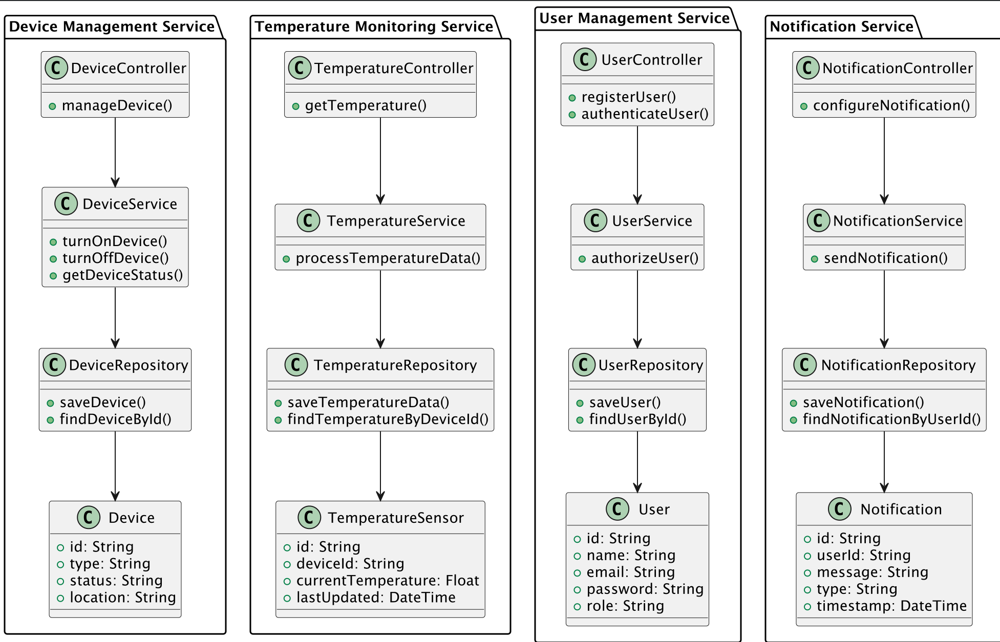

# Задание 3. Разработка ER-диаграммы

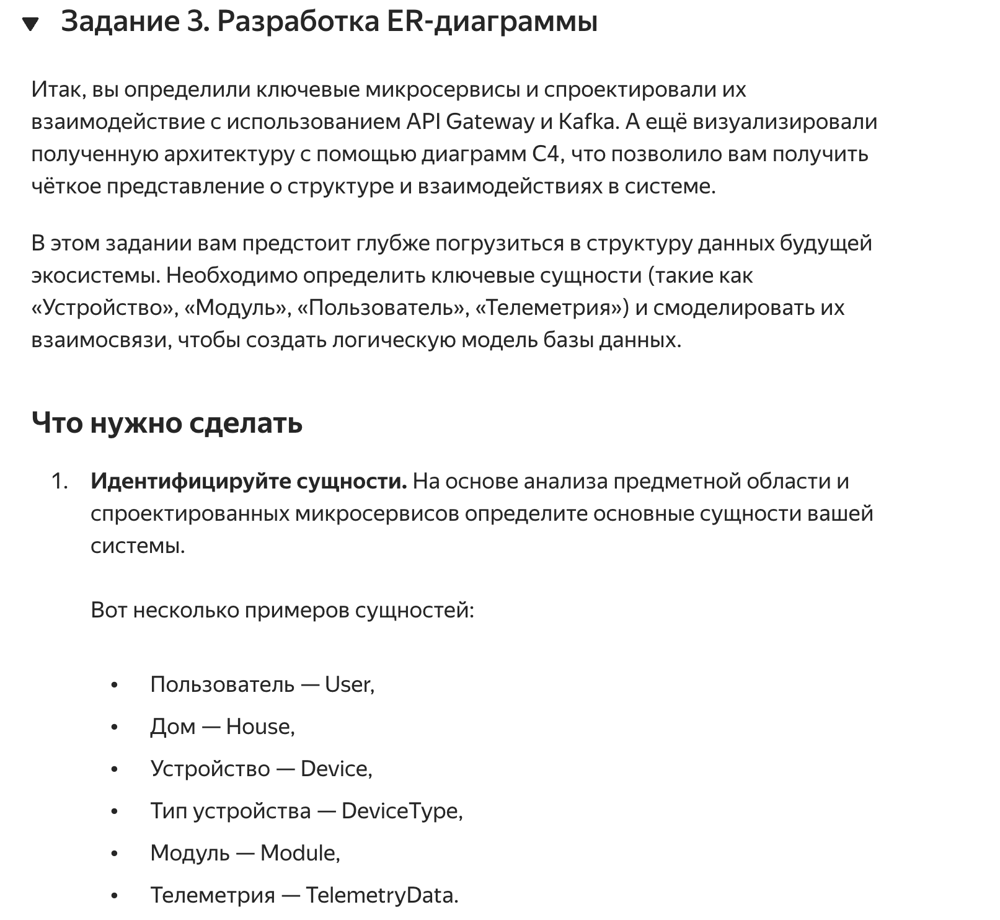

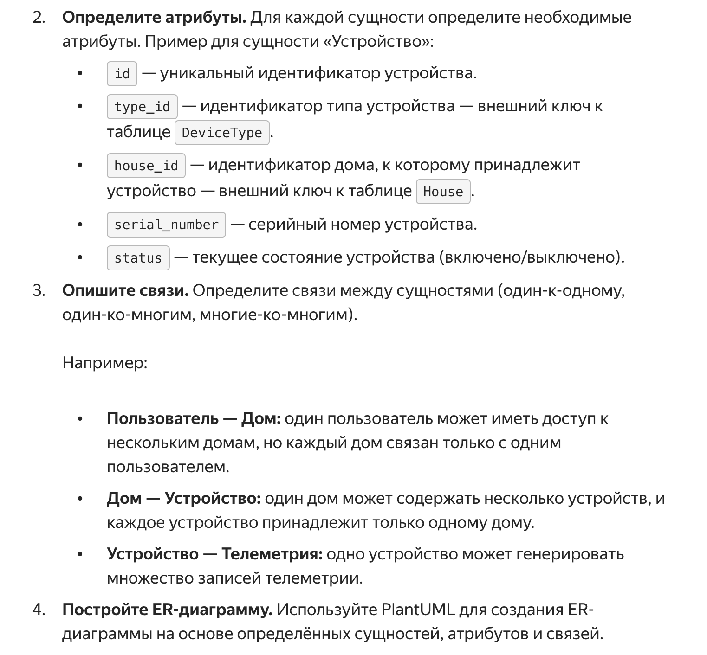

## Объяснение ER-диаграммы

- **User** — сущность, представляющая пользователя системы. Пользователь имеет атрибуты `id`, `name`, `email`, `password` и `role`. Один пользователь может быть связан с несколькими домами, а также получать множество уведомлений.

- **House** — сущность, представляющая дом, связанный с пользователем. Дом имеет атрибуты `id`, `address`, и `owner_id` (ссылка на User). Один дом может содержать несколько устройств, и каждый дом принадлежит только одному пользователю.

- **Device** — основная сущность, представляющая устройства в системе. Устройство имеет атрибуты `id`, `type_id` (ссылка на DeviceType), `house_id` (ссылка на House), `serial_number` и `status`. Одно устройство может быть связано с одним домом, но один дом может содержать несколько устройств. Устройство также может иметь привязанные к нему датчики температуры.

- **DeviceType** — сущность, представляющая тип устройства. `DeviceType` имеет атрибуты `id` и `name`, где `name` описывает тип устройства (например, датчик температуры, отопительное устройство). Один тип может быть связан с несколькими устройствами, но каждое устройство имеет только один тип.

- **TemperatureSensor** — сущность, представляющая датчики температуры, привязанные к устройствам. Датчик имеет атрибуты `id`, `device_id` (ссылка на Device), `current_temperature` и `timestamp`. Связь `Device ||--o{ TemperatureSensor` показывает, что одно устройство может иметь несколько датчиков температуры, но каждый датчик относится только к одному устройству.

- **SensorSettings** — сущность, представляющая настройки для каждого датчика температуры. `SensorSettings` имеет атрибуты `id`, `sensor_id` (ссылка на TemperatureSensor), `min_threshold`, `max_threshold`, и `alert_enabled`, что позволяет настраивать индивидуальные пороги и уведомления для каждого датчика. Связь `TemperatureSensor ||--|| SensorSettings` показывает, что у каждого датчика может быть только один набор настроек.

- **Notification** — сущность, представляющая уведомления, которые получает пользователь. Уведомление имеет атрибуты `id`, `user_id` (ссылка на User), `message`, `type`, и `timestamp`. Связь `User ||--o{ Notification` показывает, что один пользователь может получать множество уведомлений, но каждое уведомление связано с одним пользователем.

Эта ER-диаграмма описывает ключевые сущности системы и показывает их атрибуты и взаимосвязи.

Диаграмма расположена здесь:

```bash
.\С%\er.puml
```
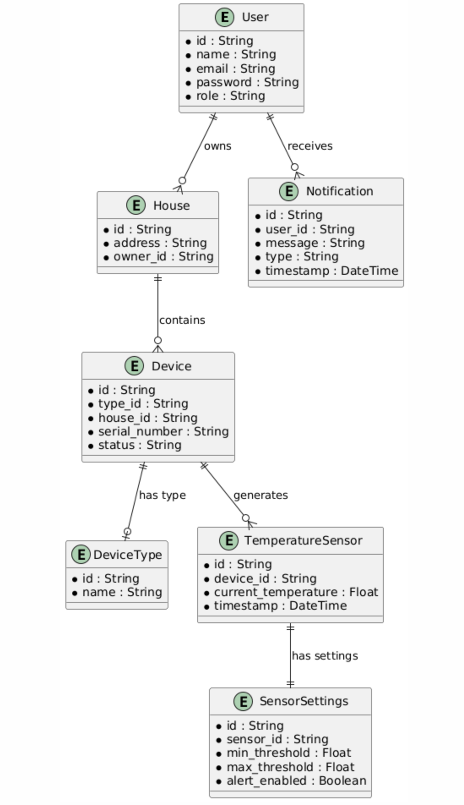

# Описание атрибутов и связей

## Сущности и атрибуты

### 1. User
- **id** — уникальный идентификатор пользователя.
- **name** — имя пользователя.
- **email** — адрес электронной почты пользователя.
- **password** — пароль пользователя.
- **role** — роль пользователя (например, администратор, пользователь).

### 2. House
- **id** — уникальный идентификатор дома.
- **address** — адрес дома.
- **owner_id** — идентификатор пользователя, который является владельцем дома (ссылка на User).

### 3. Device
- **id** — уникальный идентификатор устройства.
- **type_id** — идентификатор типа устройства (ссылка на DeviceType).
- **house_id** — идентификатор дома, к которому принадлежит устройство (ссылка на House).
- **serial_number** — серийный номер устройства.
- **status** — текущее состояние устройства (включено/выключено).

### 4. DeviceType
- **id** — уникальный идентификатор типа устройства.
- **name** — название типа устройства (например, датчик температуры, отопительное устройство).

### 5. TemperatureSensor
- **id** — уникальный идентификатор датчика температуры.
- **device_id** — идентификатор устройства, к которому прикреплен датчик (ссылка на Device).
- **current_temperature** — текущая температура, измеренная датчиком.
- **timestamp** — время последнего обновления температуры.

### 6. SensorSettings
- **id** — уникальный идентификатор настройки.
- **sensor_id** — идентификатор датчика температуры, к которому применяются настройки (ссылка на TemperatureSensor).
- **min_threshold** — минимальный порог температуры для датчика.
- **max_threshold** — максимальный порог температуры для датчика.
- **alert_enabled** — флаг, указывающий, включены ли оповещения для данного датчика.

### 7. Notification
- **id** — уникальный идентификатор уведомления.
- **user_id** — идентификатор пользователя, которому отправлено уведомление (ссылка на User).
- **message** — текст уведомления.
- **type** — тип уведомления (например, предупреждение, информация).
- **timestamp** — время отправки уведомления.

## Описание связей между сущностями

- **User - House**: Один пользователь может владеть несколькими домами, но каждый дом связан только с одним пользователем. Эта связь — один-ко-многим.
- **House - Device**: Один дом может содержать несколько устройств, и каждое устройство принадлежит только одному дому. Эта связь — один-ко-многим.
- **Device - DeviceType**: Одно устройство относится к определенному типу устройства, но каждый тип может быть общим для нескольких устройств. Это связь — многие-к-одному.
- **Device - TemperatureSensor**: Одно устройство может иметь множество записей температуры от датчиков, привязанных к нему, но каждый датчик относится только к одному устройству. Эта связь — один-ко-многим.
- **TemperatureSensor - SensorSettings**: Один датчик температуры имеет только одну запись настроек, что позволяет индивидуально настраивать пороговые значения температуры и оповещения для каждого датчика. Это связь — один-к-одному.
- **User - Notification**: Один пользователь может получать множество уведомлений, но каждое уведомление связано только с одним пользователем. Эта связь — один-ко-многим.

--

---

# Базовая настройка

## Запуск minikube

[Инструкция по установке](https://minikube.sigs.k8s.io/docs/start/)

```bash
minikube start
```

## Добавление токена авторизации GitHub

[Получение токена](https://github.com/settings/tokens/new)

```bash
kubectl create secret docker-registry ghcr --docker-server=https://ghcr.io --docker-username=<github_username> --docker-password=<github_token> -n default
```

## Установка API GW kusk

[Install Kusk CLI](https://docs.kusk.io/getting-started/install-kusk-cli)

```bash
kusk cluster install
```

## Смена адреса образа в helm chart

После того как вы сделали форк репозитория и у вас в репозитории отработал GitHub Action. Вам нужно получить адрес образа <https://github.com/><github_username>/architecture-sprint-3/pkgs/container/architecture-sprint-3

Он выглядит таким образом
```ghcr.io/<github_username>/architecture-sprint-3:latest```

Замените адрес образа в файле `helm/smart-home-monolith/values.yaml` на полученный файл:

```yaml
image:
  repository: ghcr.io/<github_username>/architecture-sprint-3
  tag: latest
```

## Настройка terraform

[Установите Terraform](https://yandex.cloud/ru/docs/tutorials/infrastructure-management/terraform-quickstart#install-terraform)

Создайте файл ~/.terraformrc

```hcl
provider_installation {
  network_mirror {
    url = "https://terraform-mirror.yandexcloud.net/"
    include = ["registry.terraform.io/*/*"]
  }
  direct {
    exclude = ["registry.terraform.io/*/*"]
  }
}
```

## Применяем terraform конфигурацию

```bash
cd terraform
terraform init
terraform apply
```

## Настройка API GW

```bash
kusk deploy -i api.yaml
```

## Проверяем работоспособность

```bash
kubectl port-forward svc/kusk-gateway-envoy-fleet -n kusk-system 8080:80
curl localhost:8080/hello
```

## Delete minikube

```bash
minikube delete
```
